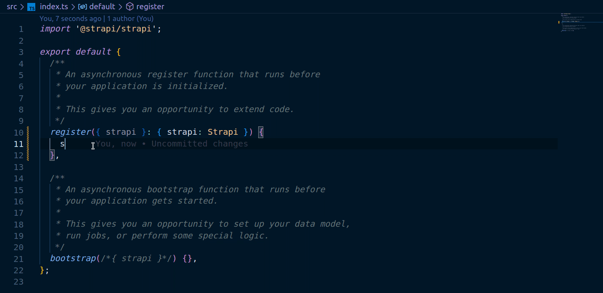

# TypeScript support

::: callout 🚧  TypeScript documentation
This section is still a work in progress and will continue to be updated and improved. Migrating existing Strapi applications written in JavaScript is not currently recommended. In the meantime, feel free to ask for help on the [forum](https://forum.strapi.io/) or on the community [Discord](https://discord.strapi.io).
:::

TypeScript adds an additional type system layer above JavaScript, which means that existing JavaScript code is also TypeScript code. Strapi supports TypeScript in new and existing projects running v4.2.0 and above. The core Developer Documentation contains code snippets in both JavaScript and TypeScript.

## Create a new TypeScript project

Create a Strapi project with Typescript support by using the `--ts` or `--typescript` flags with either the npm or yarn package manager.

::: tip
Adding the `--quickstart` flag in addition to the `--ts` flag will create a TypeScript project with an [SQLite database](/developer-docs/latest/setup-deployment-guides/installation/cli.md#creating-a-strapi-project).
:::

<!-- UPDATE these code blocks for the stable release-->

<code-group>

<code-block title="NPM">

```sh
npx create-strapi-app@beta my-app --ts
#or
npx create-strapi-app@beta my-app --typescript
```

</code-block>

<!-- <code-block title="YARN">
```sh
yarn create-strapi-app@latest my-project --ts

# or

yarn create-strapi-app@latest my-project --typescript
```
</code-block> -->

</code-group>

## Understand TypeScript support

TypeScript-enabled Strapi applications have a `dist` directory at the project root and 2 `tsconfig.json` files (see [project structure](/developer-docs/latest/setup-deployment-guides/file-structure.md)).

| TypeScript-Specific directories and files | Purpose                                                                                                                                           | Location         |
|-------------------------------------------|---------------------------------------------------------------------------------------------------------------------------------------------------|------------------|
| `./dist` directory                        | Adds the location for compiling the project JavaScript source code.                                                                               | application root |
| `build` directory                         | Contains the compiled administration panel JavaScript source code.  The directory is created on the first `yarn build` or `npm run build` command | `./dist/`         |
| `tsconfig.json` file                      | Manages TypeScript compilation for the server.                                                                                                    | application root |
| `tsconfig.json` file                      | Manages TypeScript compilation for the admin panel.                                                                                               | `./src/admin/`   |

Starting the development environment for a TypeScript-enabled project requires building the admin panel prior to starting the server. In development mode, the application source code is compiled to the `./dist/build` directory and recompiled with each change in the Content-type Builder. To start the application run the following commands in the application root directory:

<code-group>

<code-block title="NPM">

```sh
npm run build
npm run develop
```

</code-block>

 <code-block title="YARN">

```sh
yarn build
yarn develop
```

</code-block>

</code-group>

## Use TypeScript typings

To leverage your experience while using TypeScript Strapi comes with typings on the Strapi class.



## Develop a plugin using TypeScript

New plugins can be generated following the [plugins development documentation](/developer-docs/latest/development/plugins-development.md). There are 2 important distinctions for TypeScript applications:

- After creating the plugin, run `yarn install` or `npm run install` in the plugin directory `src/admin/plugins/[my-plugin-name]` to install the dependencies for the plugin.
- Run `yarn build` or `npm run build` in the plugin directory `src/admin/plugins/[my-plugin-name]` to build the admin panel including the plugin.

::: note
It is not necessary to repeat the `yarn install` or `npm run install` command after the initial installation. The `yarn build` or `npm run build` command is necessary to implement any plugin development that affects the admin panel.
:::

## Start Strapi programmatically


### Handle both Javascript and typescript codebases when starting Strapi programmatically
